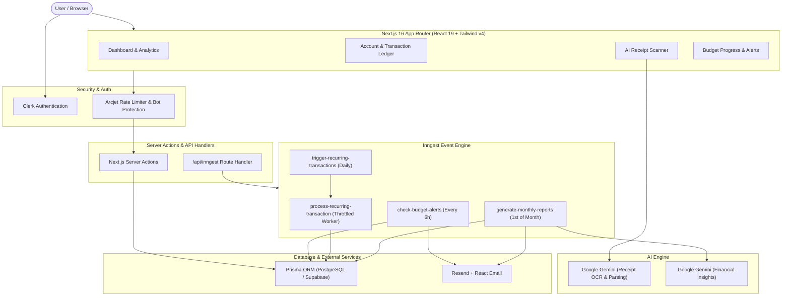

# 🚀 Flowoid - AI-Powered Finance & Wealth Management Platform

<div align="center">
  

  <p align="center">
    <strong>Built to Flow</strong> — An intelligent financial management and expense tracking platform powered by Google Gemini AI, event-driven background automation, and real-time analytics.
  </p>

  <p align="center">
    <a href="https://nextjs.org"></a>
    <a href="https://react.dev"></a>
    <a href="https://tailwindcss.com"></a>
    <a href="https://www.prisma.io"></a>
    <a href="https://www.postgresql.org"></a>
    <a href="https://ai.google.dev"></a>
    <a href="https://www.inngest.com"></a>
    <a href="https://clerk.com"></a>
    <a href="https://arcjet.com"></a>
  </p>
</div>

---

## 📖 Table of Contents

- [Overview](#-overview)
- [Key Features](#-key-features)
- [System Architecture](#-system-architecture)
- [Tech Stack](#-tech-stack)
- [Project Structure](#-project-structure)
- [Getting Started](#-getting-started)
  - [Prerequisites](#1-prerequisites)
  - [Installation](#2-installation)
  - [Environment Variables](#3-configure-environment-variables)
  - [Database Setup](#4-database-setup)
  - [Running the App](#5-start-development-servers)
- [Event-Driven Engine (Inngest Functions)](#-event-driven-engine-inngest)
- [Realistic Data Seeding](#-realistic-data-seeding)
- [Available Scripts](#-available-scripts)
- [License](#-license)

---

## 💡 Overview

**Flowoid** is a modern, full-stack personal finance and wealth management system engineered for performance, automation, and deep financial intelligence. Designed with a dark aesthetic (near-black charcoal surfaces with warm ember and amber accents), Flowoid eliminates tedious manual bookkeeping through:

- **AI-assisted vision** that parses and categorizes physical receipt photos into structured transactions.
- **Serverless event workflows** that run budget threshold monitors, recurring payments, and monthly AI financial reports automatically.
- **Interactive financial analytics** that provide real-time visibility into income, expenses, cash flow trends, and category breakdowns.

---

## 🌟 Key Features

### 📊 1. Comprehensive Financial Dashboard
- **Real-Time KPI Cards**: Monitor Total Balance, Monthly Income, Monthly Expenses, and Net Savings with month-over-month trend indicators.
- **Interactive Cash Flow Analytics**: Visualize financial trajectories over custom intervals (`1M`, `3M`, `6M`, `1Y`, `ALL`) using Recharts Area and Bar charts.
- **Spending Breakdown**: Dynamic donut/pie visualization grouped by categories with real-time percentage allocation and hover details.
- **Budget Tracking Card**: Visual budget progress bar with color-coded safety thresholds (green, amber, red) and dynamic budget update drawer.
- **Recent Transactions Feed**: At-a-glance feed of latest activity with category badges, recurring status tags, and instant edit actions.

### 🏦 2. Multi-Account Management
- Create and organize multiple accounts (e.g., **Current**, **Savings**, **Emergency Fund**).
- One-click default account toggle with instant balance re-indexing.
- Account-specific ledger views with detailed transaction histories, category icons, and search filters.
- Cascade transaction management upon account deletion.

### 🧾 3. Smart AI Receipt Scanner (Google Gemini)
- Upload or snap photos of paper receipts or digital invoices directly from your device.
- Powered by **Google Gemini AI** vision models (`gemini-3.5-flash`).
- Automatically extracts:
  - Total amount
  - Transaction date
  - Store/Merchant name
  - Itemized description summary
  - Suggested category classification
- Pre-populates the transaction creation form for single-click verification and saving.

### 🔄 4. Recurring Transactions & Scheduling
- Support for automated transaction recurrence across multiple frequencies: **Daily**, **Weekly**, **Monthly**, and **Yearly**.
- Event-driven background queue processes due transactions and updates account balances in atomic database transactions.

### ⚡ 5. Automated Budget Alerts & Email Reports
- **80% Budget Threshold Alerts**: Inngest cron automatically monitors monthly spending against user budgets every 6 hours and sends instant email warnings.
- **Monthly Financial Intelligence**: On the 1st of every month, Inngest aggregates monthly finances, queries Gemini AI for 3 tailored financial recommendations, and delivers a formatted summary email via **Resend** and **React Email**.

### 🛡️ 6. Enterprise-Grade Security & Protection
- User authentication and session control handled by **Clerk**.
- Bot detection, DDoS defense, and token-bucket rate limiting powered by **Arcjet**.
- Atomic PostgreSQL transactions with **Prisma ORM** to ensure ledger balance integrity.

---

## 🏗️ System Architecture



---

## 🛠️ Tech Stack

| Category | Technology | Description |
| :--- | :--- | :--- |
| **Framework** | [Next.js 16 (App Router)](https://nextjs.org/) | Server Actions, React Server Components, Streaming |
| **UI Library** | [React 19](https://react.dev/) | Core UI rendering engine |
| **Styling** | [Tailwind CSS v4](https://tailwindcss.com/) | Modern utility-first CSS engine with dark palette |
| **Components** | Radix UI / Shadcn / Lucide Icons | Accessible primitives, dialogs, drawers, and icons |
| **Database & ORM** | [PostgreSQL (Supabase)](https://supabase.com/) & [Prisma ORM](https://www.prisma.io/) | Relational database with type-safe client |
| **AI Vision & LLM** | [Google Generative AI (Gemini)](https://ai.google.dev/) | Receipt OCR parsing & monthly financial recommendations |
| **Workflow & Crons** | [Inngest](https://www.inngest.com/) | Serverless queues, cron schedules, and event throttling |
| **Authentication** | [Clerk](https://clerk.com/) | Secure authentication, user management, and JWT session handling |
| **Security** | [Arcjet](https://arcjet.com/) | Application security, token-bucket rate limiting, and bot defense |
| **Email Delivery** | [Resend](https://resend.com/) & [React Email](https://react.email/) | Responsive HTML email templates and transactional delivery |
| **Data Visuals** | [Recharts](https://recharts.org/) | Responsive SVG charts (Area, Bar, Donut/Pie) |

---

## 📁 Project Structure

```bash
├── actions/                  # Next.js Server Actions (CRUD & business logic)
│   ├── accounts.js           # Account creation, default switching, deletion
│   ├── budget.js             # User monthly budget queries & updates
│   ├── dashboard.js          # Dashboard aggregation & summary data
│   ├── seed.js               # Realistic multi-year transaction generator (2025-2026)
│   ├── send-email.js         # Resend transactional email dispatcher
│   └── transaction.js        # Transaction mutations, rate limiting & Gemini OCR
├── app/                      # Next.js App Router
│   ├── (auth)/               # Clerk authentication routes (sign-in / sign-up)
│   ├── (main)/               # Authenticated application portal
│   │   ├── account/[id]/     # Account ledger & transaction filtering table
│   │   ├── dashboard/        # Main financial analytics dashboard
│   │   └── transaction/      # Add/edit transaction form & receipt scanner
│   ├── api/inngest/          # Inngest webhook route endpoint
│   ├── globals.css           # Global Tailwind CSS v4 design tokens & themes
│   ├── layout.js             # Root application layout with Clerk & Sonner providers
│   └── page.jsx              # High-conversion marketing landing page
├── components/               # Shared UI & Layout Components
│   ├── app-sidebar.jsx       # Collapsible navigation sidebar
│   ├── create-account-drawer.jsx # Drawer dialog for new account setup
│   ├── flowoid-loader.jsx    # Custom animated liquid finance loader
│   ├── Header.jsx            # Site header with user profile menu & quick actions
│   ├── Hero.jsx              # Landing page hero with animated preview
│   └── ui/                   # Reusable base components (buttons, cards, inputs)
├── data/                     # Categories, landing page stats, and features
├── hooks/                    # Custom React hooks (e.g. useFetch)
├── lib/                      # Core configuration & client singletons
│   ├── arcjet.js             # Arcjet security & rate limit initialization
│   ├── prisma.js             # Prisma Client instance
│   └── inngest/              # Inngest client & automated workflows
│       ├── client.js         # Inngest client configuration
│       └── functions.js      # Cron jobs & event handler definitions
├── prisma/                   # Database schema & migrations
│   └── schema.prisma         # Models: User, Account, Transaction, Budget
├── public/                   # Static assets, logos, icons, and hero banners
└── react-email-starter/      # React Email templates for alerts & monthly reports
    └── emails/template.jsx   # Dynamic email layout for budget alerts & reports
```

---

## ⚡ Getting Started

### 1. Prerequisites

Make sure you have the following installed on your machine:
- [Node.js](https://nodejs.org/) (v18.17+ or v20+ recommended)
- [npm](https://www.npmjs.com/) or [pnpm](https://pnpm.io/)
- A free [Supabase](https://supabase.com/) or PostgreSQL database
- API Keys for **Clerk**, **Google Gemini AI**, **Inngest**, **Arcjet**, and **Resend**

---

### 2. Installation

Clone the repository and install all required dependencies:

```bash
# Clone the repository
git clone https://github.com/your-username/flowoid-ai-finance.git

# Navigate into the project directory
cd flowoid-ai-finance

# Install dependencies
npm install
```

---

### 3. Configure Environment Variables

Create a `.env` file in the root of the project:

```bash
cp .env.example .env # Or create a new .env file
```

Fill in your respective API credentials:

```env
# ==========================================
# Clerk Authentication
# ==========================================
NEXT_PUBLIC_CLERK_PUBLISHABLE_KEY=pk_test_...
CLERK_SECRET_KEY=sk_test_...
NEXT_PUBLIC_CLERK_SIGN_IN_URL=/sign-in
NEXT_PUBLIC_CLERK_SIGN_UP_URL=/sign-up
NEXT_PUBLIC_CLERK_SIGN_IN_FALLBACK_REDIRECT_URL=/dashboard
NEXT_PUBLIC_CLERK_SIGN_UP_FALLBACK_REDIRECT_URL=/dashboard

# ==========================================
# Database Connection (Supabase / PostgreSQL)
# ==========================================
DATABASE_URL="postgresql://postgres:[PASSWORD]@[HOST]:6543/postgres?pgbouncer=true"
DIRECT_URL="postgresql://postgres:[PASSWORD]@[HOST]:5432/postgres"

# ==========================================
# Arcjet Application Security & Rate Limiting
# ==========================================
ARCJET_KEY=ajkey_...

# ==========================================
# Resend Email Delivery
# ==========================================
RESEND_API_KEY=re_...

# ==========================================
# Google Gemini AI (Receipt OCR & Financial Insights)
# ==========================================
GEMINI_API_KEY=AIzaSy...
```

---

### 4. Database Setup

Push the Prisma schema to your PostgreSQL database and generate the Prisma client:

```bash
# Push schema changes to your database
npx prisma db push

# Generate Prisma Client
npx prisma generate
```

---

### 5. Start Development Servers

#### 🔹 Terminal 1: Next.js Web Application
```bash
npm run dev
```
Open [http://localhost:3000](http://localhost:3000) in your browser to view Flowoid.

#### 🔹 Terminal 2: Inngest Background Dev Server
```bash
npm run inngest:dev
```
Open [http://localhost:8288](http://localhost:8288) to access the Inngest local dashboard for viewing, testing, and triggering cron jobs and background events.

---

## ⚙️ Event-Driven Engine (Inngest)

Flowoid uses **Inngest** to execute serverless background jobs, scheduled crons, and throttled queues with automatic retries:

| Function ID | Trigger Type | Schedule / Event | Purpose |
| :--- | :--- | :--- | :--- |
| `check-budget-alerts` | **Cron** | `0 */6 * * *` (Every 6h) | Calculates month-to-date spending vs. budget. Sends an alert email via Resend if spending $\ge 80\%$. |
| `trigger-recurring-transactions` | **Cron** | `0 0 * * *` (Daily at midnight) | Scans for due recurring transactions and emits `transaction.recurring.process` events. |
| `process-recurring-transaction` | **Event** | `transaction.recurring.process` | Throttled per user (10/min). Creates new transaction instances, updates balances, and calculates next due dates. |
| `generate-monthly-reports` | **Cron** | `0 0 1 * *` (1st of month) | Compiles previous month's financial metrics, requests AI recommendations from Gemini, and emails monthly digest. |

---

## 🎲 Realistic Data Seeding

To preview Flowoid with extensive historical data without manual entry:
1. Sign up / log in to Flowoid and create at least one account (e.g., *Main Checking* or *Savings*).
2. Click the **"Seed Historical Data"** button on the Dashboard header (or trigger `seedTransactions()` server action).
3. Flowoid will automatically populate your account with realistic transactions spanning **January 1, 2025 through August 1, 2026** (including bi-weekly salaries, rent, utilities, groceries, transportation, dining, leisure, and travel).
4. Any new account created in the future remains completely clean and isolated.

---

## 📜 Available Scripts

| Command | Description |
| :--- | :--- |
| `npm run dev` | Runs the Next.js development server on `http://localhost:3000` |
| `npm run inngest:dev` | Starts the Inngest local CLI dev environment on `http://localhost:8288` |
| `npm run build` | Generates the Prisma client and creates an optimized Next.js production build |
| `npm run start` | Boots the Next.js production server |
| `npm run lint` | Checks code formatting and syntax with ESLint |
| `npx prisma studio` | Opens Prisma Studio GUI in browser for inspecting and editing database records |

---

## 📄 License

This project is open-source and licensed under the [MIT License](LICENSE).
